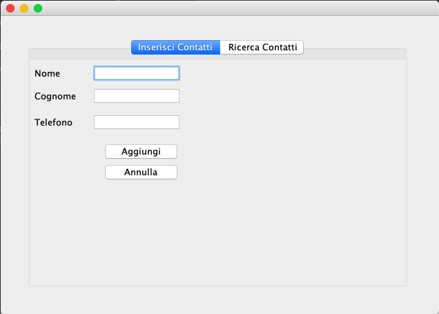
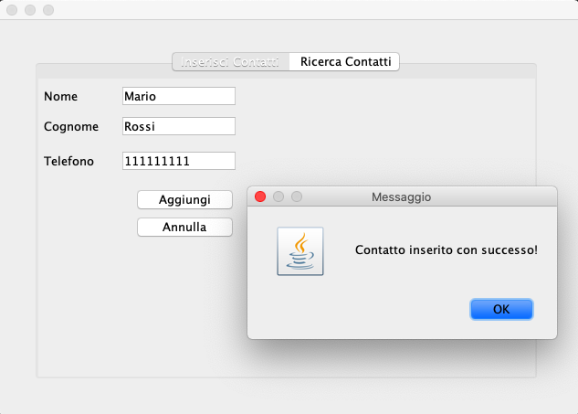
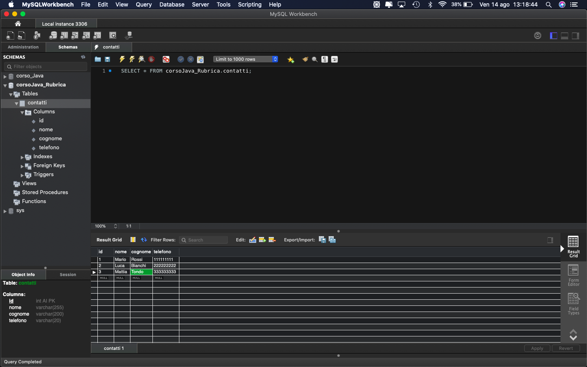
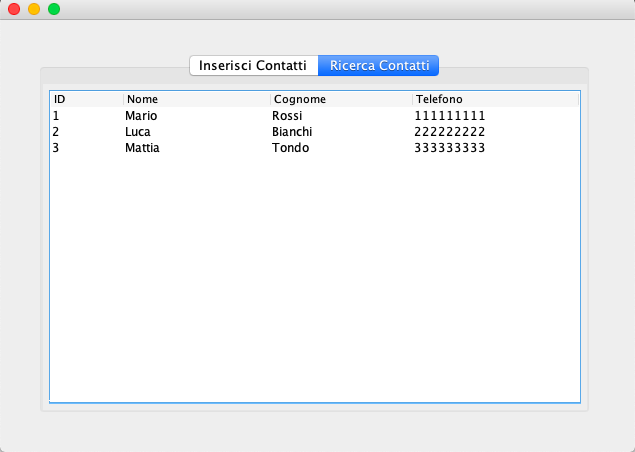

# Rubrica 📚

A simple application built in Java 8.

It allows to insert the data of a single user through an interface created in Swing.

    

## Programs used:
- Java 8
- Swing / AWT
- MySQL 

### How does it work? 💻
After successfully installing Java 8 and MySQL (Workbench for convenience), the latter starts, making the connection active.
The connection is possible only after downloading and installing the MySQL Connector **jar** from the official website and pasting it into the project.
A "getConnection( )" function is created to better manage the connection.

Now it's possible to start the application and fill in the various fields:

    

The entered contact will be automatically added to the Database.
*The latter has been constructed in order to avoid SQL Injection.*

After entering all the fields you have a result similar to this:

    

Finally, you can return to the application and check all the elements already entered:

    

*I hope this simple application will help you understand how Java interacts with databases.*
 

#### If you find this helpful, please leave a star. 🌟

